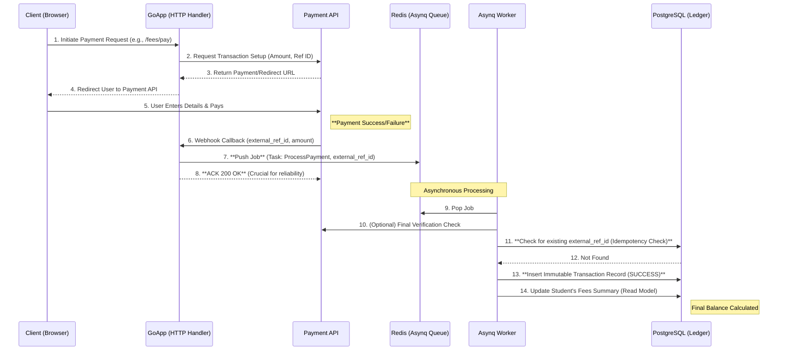

## 🏗️ Architectural Design

###  System Context Diagram (C4 - Level 1)

This diagram outlines the major containers and their communication channels.

```mermaid
C4Container
    title School Management System Architecture
    
    Container(Client, "Web Browser/Client", "HTML/CSS/JS/HTMX/Templ", "User Interface")
    
    Container_Boundary(SMSServer, "School Management System (Go Monorepo)") {
        Container(GoApp, "Go Backend Service", "Golang, HTTP Server", "API Endpoints (REST/HTMX) and Business Logic.")
        Container(AsynqWorker, "Asynq Worker Pool", "Golang, Asynq/Redis", "Handles long-running tasks: Payment Processing, Report Generation, Emails.")
    }
    
    Container(Postgres, "PostgreSQL Database", "SQL", "Persistent storage for all core data (Users, Students, Grades, Transactions Ledger).")
    Container(Redis, "Redis Cache & Queue", "In-Memory Data Structure", "Used for: 1. Session Store (IAM), 2. Asynq Job Queue, 3. Fast-read Caching (Academic Year).")
    
    System(PaymentAPI, "External Payment Gateway", "REST/Webhooks", "Handles card processing and bank communications securely.")
    
    Rel(Client, GoApp, "Uses HTMX/HTTP")
    Rel(GoApp, Postgres, "Reads/Writes Data (SQL)")
    Rel(GoApp, Redis, "Reads/Writes Sessions & Cache")
    Rel(GoApp, PaymentAPI, "Initiates Payment Request (Sync)")
    Rel(GoApp, AsynqWorker, "Queues Tasks (via Redis)")
    Rel(PaymentAPI, GoApp, "Sends Payment Confirmation Webhook (Async)")
    Rel(AsynqWorker, Postgres, "Updates Ledger (Transaction Status)")
    Rel(AsynqWorker, Redis, "Manages Job Queue")
    
    UpdateLayoutStyle(GoApp, $width=200, $height=150)
    UpdateLayoutStyle(AsynqWorker, $width=200, $height=150)
````

-----

### Domain Decomposition and Modular Structure
```mermaid
graph TD
    subgraph Monorepo Root
        A[cmd/server: Main Entry] --> B(internal/iam: Identity & Access)
        A --> C(internal/academic: Core Calendar, Classes)
        A --> D(internal/student: Enrollment, Profiles, Promotions)
        A --> E(internal/finance: Fees, Ledger, Payments)
        A --> F(internal/gradebook: Grades, Subjects)
        A --> G(internal/discipline: Remarks, Infractions)
        
        subgraph Academic Core Context
            C --> C1(Year/Term Service)
            C --> C2(Class/Subject Repository)
        end
        
        subgraph Finance Context
            E --> E1[Payment Service: API Integrator]
            E1 --> E2[Transaction Repository (Immutable Ledger)]
            E1 --> E3[Asynq Worker: Process Webhooks]
        end
        
        subgraph IAM Context
            B --> B1[Auth Service]
            B1 --> B2(Redis Session Store)
            B --> B3[User Repository (Postgres)]
        end
    end
```

-----

### Asynchronous Payment Flow



